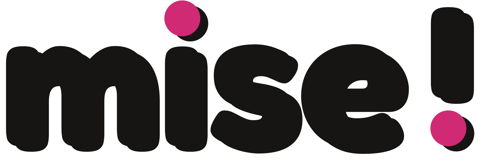
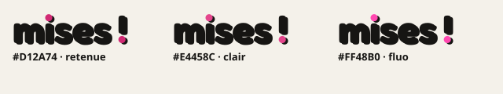
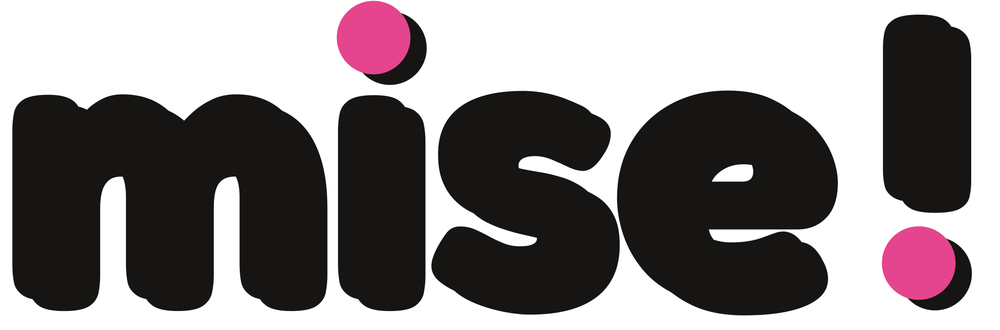
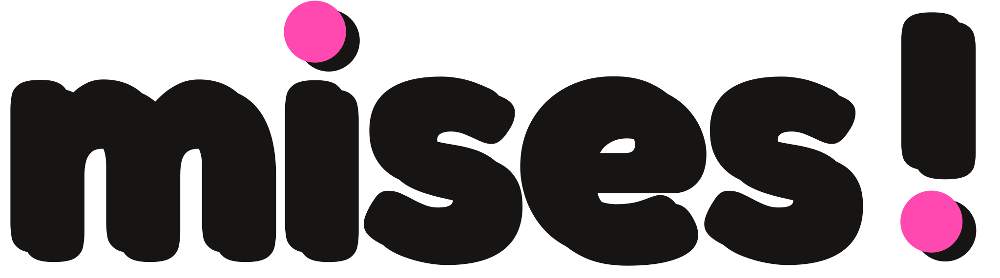

# Identité visuelle — MISE ! 0.3.0-beta.3

## D’où vient l’esprit

Le nom réel n’est pas dans le dépôt. Il est dans un dossier privé : **Musiques en jeu(x) – LE KIT**, boîte de jeux sonores coopératifs (Odia Normandie). La couverture et les premières pages du dossier de presse et du livret ont servi de référence.

Dans le dépôt public, on ne trouve qu’une mention pédagogique (`inspired_by_musiques_en_jeux` dans `public/data.json`). La branche `codex/modern-project-vision-20260925` est une autre direction, plus sobre. Ce n’est pas cette charte.

C’est une marque tierce. MISE ! n’en reprend ni le logo, ni le mot, ni les photos, ni les dessins, ni les lettres posées dans les jetons. Les images de référence ne sont pas dans ce dépôt.

Ce qui est gardé, c’est le rendu **sérigraphié, une seule encre** : un aplat fort, le blanc du papier, le noir pour lire, des blocs plats, une trame de points, des jetons vides (cercle, hexagone, pentagone), des ondes. L’encre est un rose d’imprimerie. Le terrain (recherche, fiches, caisses) reste lisible, avec un liseré de la même encre. Le jeu est réservé au Vibe, aux exercices et à « Crée ton bruitage ». Régie enlève la trame, les jetons et la couleur.

## Une seule encre

Toute la couleur de l’interface passe par `--ink` dans `src/identity.css`. Pour en changer plus tard : modifier cette ligne, puis lancer `node scripts/export-icons.mjs`. Le script régénère les PNG et recopie la même valeur dans les SVG, l’écran de démarrage, le manifeste et les ressources Android.

Le papier (`--paper`, `#f4f1ea`) et le noir de texte (`--type`, `#161513`) ne sont pas une deuxième encre. Le fond sombre est `#141311`.

L’encre ne sert pas de petit texte sur le fond sombre. Sur ce fond, l’encre est un bloc (logo, boutons terrain, panneaux Vibe) avec du blanc dedans. Les cartouches et les cartes ont un contour de la même encre : l’encre elle-même en clair, une teinte éclaircie en sombre pour que le filet se voie. Les deux points du nom sont l’encre sur le papier clair, et une teinte claire de la même encre sur le fond sombre. En Régie, lettres et points sont noirs sur blanc, sans rose.

## Encre retenue

Rose d’imprimerie `#D12A74`.

Blanc sur ce rose : contraste 4,9. Rose sur le papier `#f4f1ea` : contraste 4,3. Le texte posé sur l’aplat reste blanc. Le logo monochrome (`public/brand/logo-mono.svg`) reste le même dessin en noir pour l’étiquette thermique.

Les roses plus fluo `#E4458C` et `#FF48B0` ont été mesurés. Le blanc dessus tombe à 3,8 et 3,1 : trop juste pour le texte des boutons. Ils restent dans `public/brand` comme comparaison, pas comme encre de l’application.

## Deux variantes, non utilisées

Rose clair `#E4458C`. Blanc dessus : contraste 3,8.

Rose fluo `#FF48B0`. Blanc dessus : contraste 3,1.

## Le logo est le mot

Le mot **mise !** est le logo, dans la variante **Tampon** : une seconde passe du même dessin, décalée vers le bas et la droite, comme un tirage sérigraphié mal calé. Minuscules, sans capitale, dans une sans arrondie. La police est Fredoka (SIL Open Font License), embarquée dans `src/fonts/` avec sa licence `OFL.txt`. Le dessin du logo est vectorisé : il ne dépend pas du chargement de la police, et il reste net hors ligne.

Les lettres prennent la couleur de lecture : noir doux sur le papier, crème sur le fond sombre, blanc en Régie. Les deux points — celui du i, au-dessus, et celui du !, en dessous — prennent l’encre. Sur le fond sombre, l’encre brute est trop proche du noir : les points passent à une teinte claire de la même encre (mélange avec le blanc, contraste environ 9). En Régie, lettres et points sont noirs sur un blanc.

L’impression une couleur est `logo-mono.svg` : le même dessin, tout en noir, y compris les deux points. L’étiquette thermique l’imprime ainsi, pour que le QR se lise. `logo-mono-light.svg` est le même trait en blanc.

L’icône de l’application est **m!**, en blanc sur le carré d’encre, avec le décalage du tampon. Le mot entier ne tient pas à cette taille. L’étiquette thermique reprend le mot en une encre, sans ce décalage, pour laisser le QR net. En régie, le tampon est noir sur un blanc, sans encre de couleur.

Les pistes dessinées avant ce choix (caisse dans un jeton, objet qui devient une onde, point d’exclamation sur une ligne) ne sont plus le logo.

Cinq autres études du mot, à choisir, sont dans `docs/design/` : mailloche, jeton, onde, tampon, pile. Elles ne sont pas branchées dans l’application.

## Système retenu

- Encre `#D12A74` pour les aplats, les liserés et les deux points du mot, sur le papier. Papier `#f4f1ea`, texte `#161513` (contraste 16,2).
- Sombre : fond `#141311`, texte `#f4f1ea` (contraste 16,5). L’encre reste un aplat. Le filet des cartes est une teinte claire du même rose.
- Clair : page papier, cartes presque blanches, blocs de l’encre.
- Régie : noir et blanc. Pas de trame, pas de jetons, pas d’encre. Le logo passe en noir sur blanc, comme l’impression une couleur.
- Les cartes « possédé », « suggestion » et « incertain » ne se ressemblent pas.
- Les exercices, le Vibe et « Crée ton bruitage » utilisent le panneau sérigraphié. Les fiches et les caisses restent plus calmes.
- Modes conservés : Auto / Ordinateur / Mobile, et Système / Sombre / Clair / Régie.

Les contrastes sont mesurés (WCAG, blanc `#ffffff` sur l’encre, encre sur `#f4f1ea`).

## Où le logo est branché

- Maître : `public/brand/logo.svg` (lettres noires, points en encre). Une encre : `logo-mono.svg`. Encre claire : `logo-mono-light.svg`.
- Le fichier servi dans l’en-tête est `src/brand/wordmark.svg` (les mêmes tracés, couleurs laissées au thème).
- PWA : `public/icon.svg` et les PNG, dessinés à partir de « m! ».
- Android : icône adaptative, premier plan « m! », fond encre, couche monochrome noire.
- Étiquette imprimée : le mot « mise ! » en noir, au-dessus du nom et du QR.
- Pour régénérer après un changement de `--ink` : `node scripts/export-icons.mjs`.
