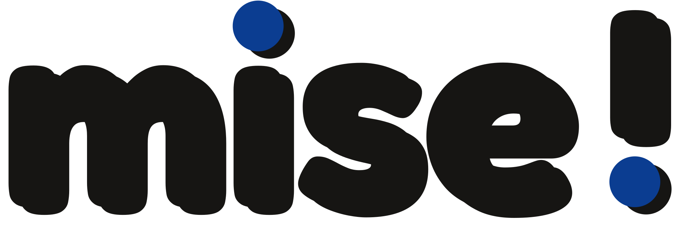
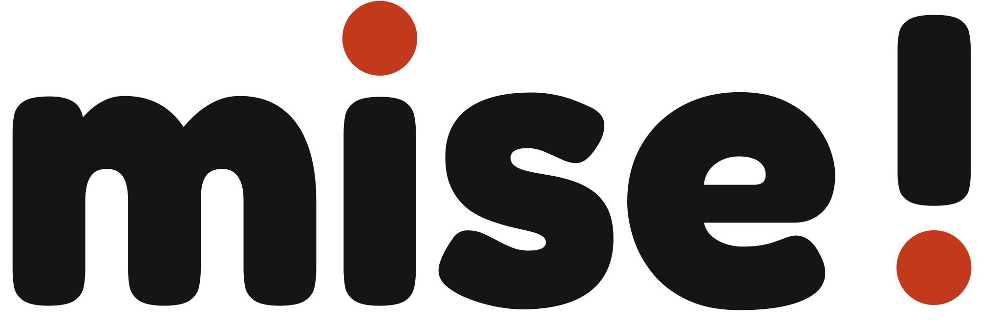
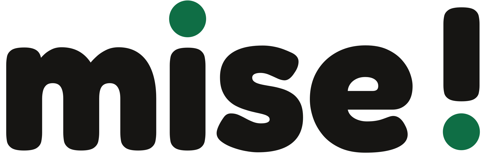

# Identité visuelle — MISE ! 0.3.0-beta.1

## D’où vient l’esprit

Le nom réel n’est pas dans le dépôt. Il est dans un dossier privé : **Musiques en jeu(x) – LE KIT**, boîte de jeux sonores coopératifs (Odia Normandie). La couverture et les premières pages du dossier de presse et du livret ont servi de référence.

Dans le dépôt public, on ne trouve qu’une mention pédagogique (`inspired_by_musiques_en_jeux` dans `public/data.json`). La branche `codex/modern-project-vision-20260925` est une autre direction, plus sobre. Ce n’est pas cette charte.

C’est une marque tierce. MISE ! n’en reprend ni le logo, ni le mot, ni les photos, ni les dessins, ni les lettres posées dans les jetons. Les images de référence ne sont pas dans ce dépôt.

Ce qui est gardé, c’est le rendu **sérigraphié, une seule encre** : un aplat fort, le blanc du papier, le noir pour lire, des blocs plats, une trame de points, des jetons vides (cercle, hexagone, pentagone), des ondes. Le rose n’est plus demandé. Le terrain (recherche, fiches, caisses) reste lisible. Le jeu est réservé au Vibe, aux exercices et à « Crée ton bruitage ». Régie enlève la trame, les jetons et la couleur.

## Une seule encre

Toute la couleur de l’interface passe par `--ink` dans `src/identity.css`. Pour en changer plus tard : modifier cette ligne, puis lancer `node scripts/export-icons.mjs`. Le script régénère les PNG et recopie la même valeur dans les SVG, l’écran de démarrage, le manifeste et les ressources Android.

Le papier (`--paper`, `#f4f1ea`) et le noir de texte (`--type`, `#161513`) ne sont pas une deuxième encre. Le fond sombre est `#141311`.

L’encre ne sert pas de petit texte sur le fond sombre : le contraste tombe à 1,8. Sur ce fond, l’encre est un bloc (logo, boutons terrain, panneaux Vibe) avec du blanc dedans. Les deux points du nom sont l’encre sur le papier clair, et le blanc du papier sur le fond sombre ou en Régie.

## Encre retenue

Bleu d’imprimerie `#0B3D91`.

Blanc sur ce bleu : contraste 10,0. Bleu sur le papier `#f4f1ea` : contraste 8,9. Lisible sur un téléphone, en clair comme en sombre, et le logo monochrome (`public/brand/logo-mono.svg`) reste le même dessin en noir pour l’étiquette thermique.

## Deux variantes, non utilisées

Vermillon `#C23A1B`. Blanc dessus : contraste 5,4. Sur le papier : 4,8. Juste au-dessus du seuil pour un grand texte, plus faible en petit.

Vert affiche `#0F6E45`. Blanc dessus : contraste 6,3. Sur le papier : 5,6. Lisible, moins tranché que le bleu une fois imprimé en une passe.

## Trois directions de logo

Les fichiers sont dans `public/brand/`.

### 1. Caisse vibrante dans un jeton — retenue

Une caisse et une onde, dans un cercle de papier, sur un carré de l’encre. Un hexagone vide à côté : un jeton, sans lettre. Caisse, onde et point sont la même encre. Le nom MISE ! reste le mot, avec ses deux points alignés. L’impression une couleur est `logo-mono.svg` (noir et blanc du papier). L’étiquette thermique reprend le dessin en noir, sans la trame, pour que le QR se lise.

### 2. Un objet qui devient une onde — écartée

Un cercle (l’objet) se prolonge en vagues. Lisible, mais trop générique : on ne voit ni la caisse, ni le rangement, ni le plateau.

### 3. Point d’exclamation scène — écartée

Le point d’exclamation du nom, posé sur une ligne de scène. Fort comme symbole, faible comme icône d’application : il ne dit pas « objet » ni « bruitage ».

## Système retenu

- Encre `#0B3D91`, papier `#f4f1ea`, texte `#161513` sur le papier (contraste 16,2).
- Sombre : fond `#141311`, texte `#f4f1ea` (contraste 16,5). L’encre reste un aplat, pas un filet fin.
- Clair : page papier, cartes presque blanches, blocs de l’encre.
- Régie : noir et blanc. Pas de trame, pas de jetons, pas d’encre. Le logo passe en noir sur blanc, comme l’impression une couleur.
- Les cartes « possédé », « suggestion » et « incertain » ne se ressemblent pas.
- Les exercices, le Vibe et « Crée ton bruitage » utilisent le panneau sérigraphié. Les fiches et les caisses restent plus calmes.
- Modes conservés : Auto / Ordinateur / Mobile, et Système / Sombre / Clair / Régie.

Les contrastes sont mesurés (WCAG, blanc `#ffffff` sur l’encre, encre sur `#f4f1ea`).

## Où le logo est branché

- Maître couleur : `public/brand/logo.svg`. Maître une encre : `logo-mono.svg`. Version encre claire : `logo-mono-light.svg`.
- PWA : `public/icon.svg`, `favicon.svg`, `icon-maskable.svg`, `icon-192.png`, `icon-512.png`, `apple-touch-icon.png`. Le manifeste Vite les déclare.
- Application : en-tête (`.miseLogo4`) et écran de démarrage dans `index.html`.
- Android : icône adaptative premier plan / fond / monochrome (`mipmap-anydpi-v26/ic_launcher.xml`). Le monochrome est une silhouette noire, pour l’impression et les thèmes d’icône.
- Étiquette imprimée : le même dessin, en noir sur blanc, à côté de « MISE ! », du nom et du QR.
