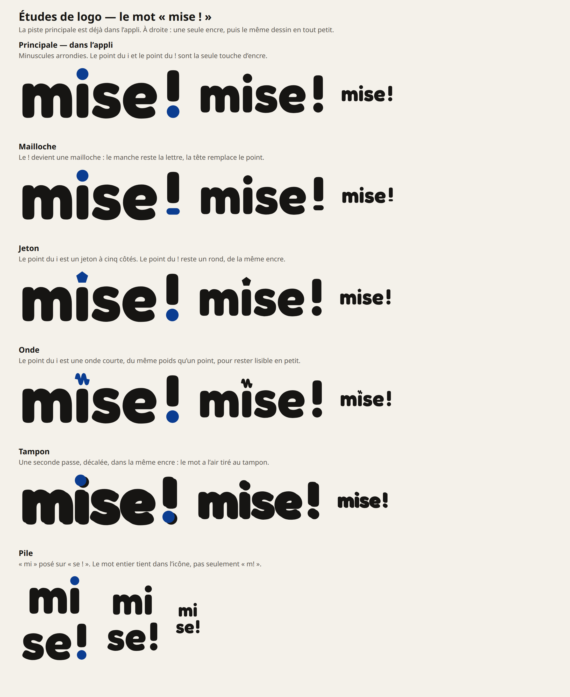
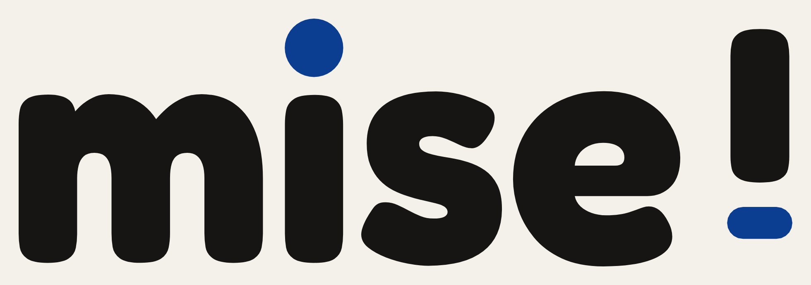
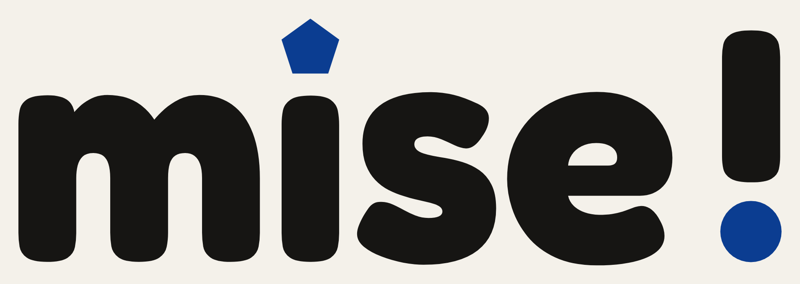
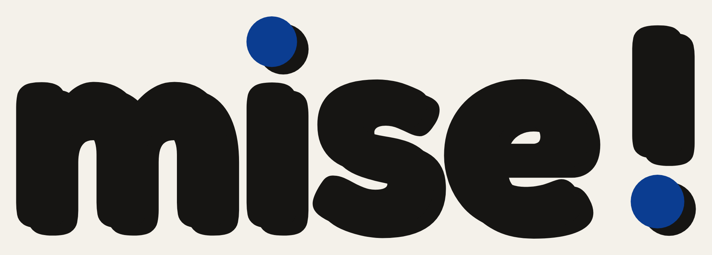
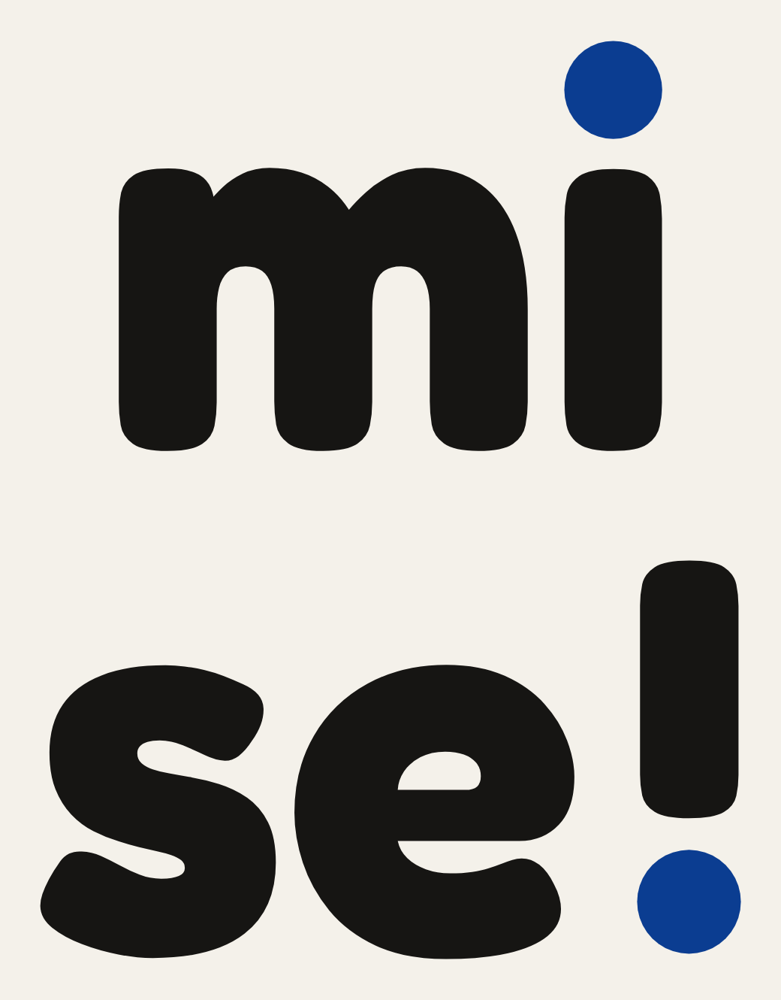
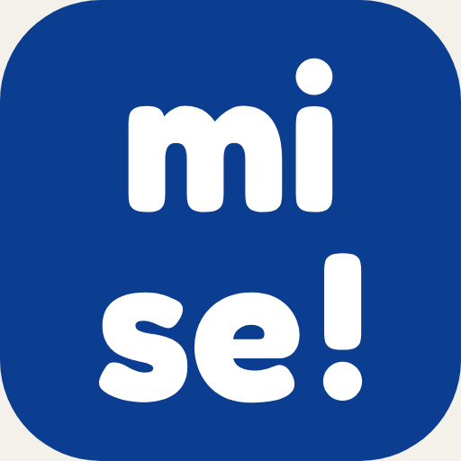

# Études de logo

La piste retenue est **Tampon**. C’est le logo dans l’application : le mot **mise !**, avec une seconde passe décalée, comme un tirage mal calé. Les points du i et du ! portent l’encre.

L’icône (PWA, Android, favicon) est **m!**, avec le même effet. Le mot entier ne reste pas lisible à cette taille. L’étiquette thermique est le mot en une encre, sans le décalage, pour que le QR se lise. En régie, le tampon est noir sur blanc.

Évolution progressive proposée (sans refonte totale) : [EVOLUTION-LOGO.md](EVOLUTION-LOGO.md).

Les autres dessins restent des études. Ils ne sont pas dans l’application.

La police est Fredoka, licence SIL OFL, la même que le logo en place. Les lettres sont vectorisées. Ce ne sont pas des visuels de Musiques en jeu(x) – LE KIT, ni d’Odia.

Chaque piste se lit aussi en une seule encre : le fichier `*-encre.svg` est le même dessin, tout en noir, pour une étiquette ou une impression.

La planche réunit la piste principale et les cinq variantes, en couleur, en une encre, et en tout petit.

## Piste principale — étude

Minuscules arrondies, sans seconde passe. Remplacée par Tampon.

## Mailloche

Le ! devient une mailloche : le manche reste la lettre, la tête remplace le point.

## Jeton

Le point du i est un jeton à cinq côtés. Le point du ! reste un rond, de la même encre.

## Onde

Le point du i est une onde courte, du même poids qu’un point, pour rester lisible en petit.

## Tampon — retenue

Une seconde passe, décalée, dans la même encre : le mot a l’air tiré au tampon. C’est le logo en place.

## Pile

« mi » posé sur « se ! ». Le mot entier tient dans l’icône, pas seulement « m! ».

Une liaison entre le i et le s a été dessinée, puis laissée hors de la planche : en petit, elle se lit comme un défaut d’approche, pas comme un choix.

Pour régénérer les fichiers : `python3 scripts/build-logo-studies.py`.
